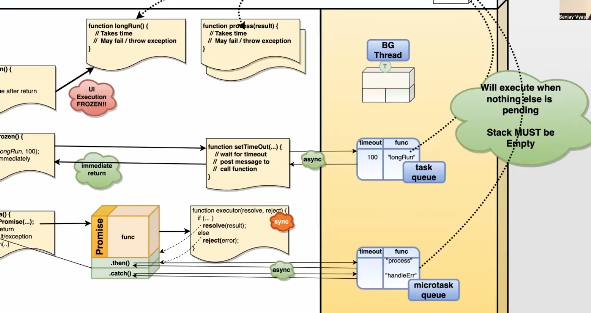

Promise:
Promise is an object which calls a function and asks 
(i) if succeeded 
(ii) or fail 
and based on it takes action

Its created to solve an issue called  call back hell

Promise calls it executer and  waits for it .
further if success :  .then() 
if fail :  .catch()

