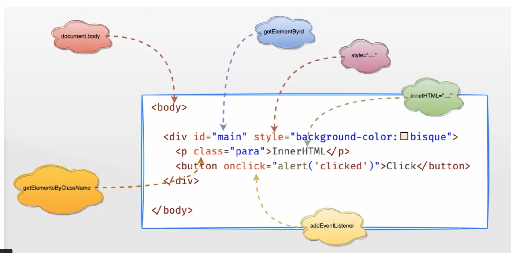
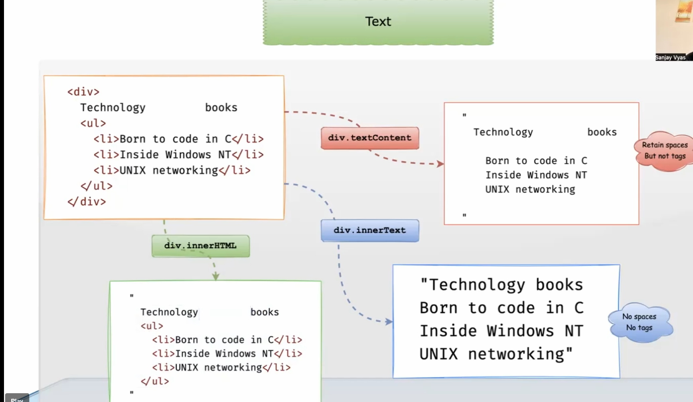

Manipulating Elements






Creating Elements

````HTML````
<!DOCTYPE html>
<html lang="en">

<head>
<title>Create Elements </title>
</head>
<body>
    <div>
        <h1></h1>
        <ul id="list">list</ul>
    </div>

    <button onclick="addH1()">Add h1</button>
    <button onclick="addLi()">Add li</button>
    <button onclick="addHTML()">Add HTML</button>
<script>
    function addH1() {
        const h1=document.querySelector("div>h1");
        h1.innerHTML="Task Manager";
    }

    function addLi() {
        const li=document.createElement("li");
        li.innerHTML="Learn DOM";

        const ul=document.querySelector("#list");
        ul.appendChild(li);
    }

    function addHTML(){
        const template= `
        <li>learn css</li>
         <li>learn Javascript</li>
        `;

        const ul=document.querySelector("#list");
        ul.insertAdjacentHTML("beforeend",template);
         
        
    }

</script>

</body>


</html>    

