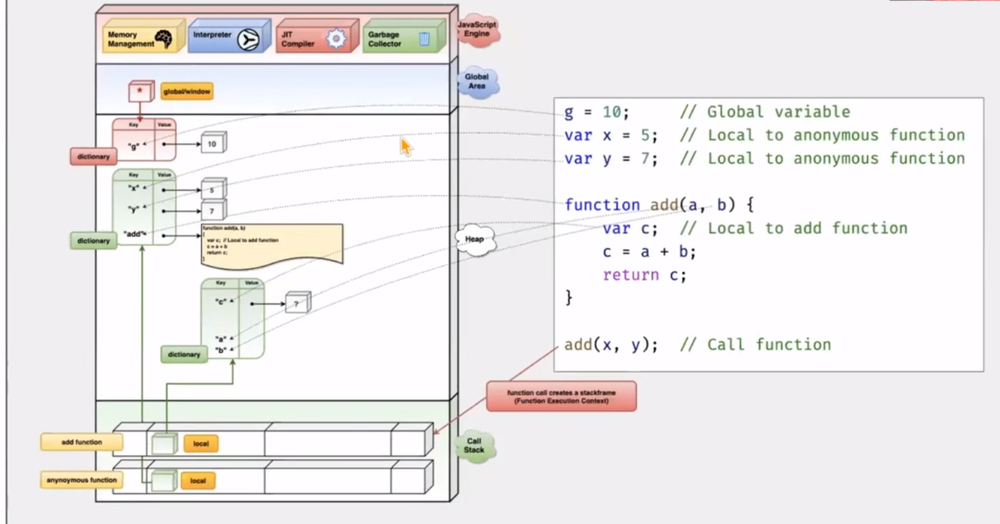

Below is image file Link for JS Process Map

Javascript Execution Engime gets loaded.
-Memory Management
Memory management in JavaScript is handled automatically by the runtime environment, typically the JavaScript engine in web browsers or Node.js. JavaScript uses a garbage collector to manage memory and ensure that developers do not need to manually allocate or deallocate memory.

Allocates the memory we need: JavaScript allocates memory to the object created.

1. Use the allocated memory.
2. Release the memory when not in use: Once the allocated memory is released, it is used for other purposes. It is handled by a JavaScript engine.
3. The second stage is the same for all the languages. However, the first and last stages are implicit in high-level languages like JavaScript.

-Interpreter- The Interpreter ensures that code execution can immediately ensure faster startup.

-JIT Compiler

Just-In-Time Compiler (JIT):
JIT comprises three primary phases: Profiler, Baseline Compiler, and Optimizing Compiler.

Profiler: Also referred to as a monitor, the profiler tracks the portions of code running most frequently while the JavaScript (JS) code passes through the JS engine. It identifies frequently used code, designating it as “WARM.” If the same code is used even more frequently, it becomes “HOT CODE.” The profiler extracts the most commonly executed code from our source code.

Baseline Compiler: The WARM or HOT code is then translated into bytecode within the Baseline Compiler.

Optimizing Compiler: The HOT parts identified by the profiler are passed to the optimizing compiler. Its main task is to transform these hot parts into an optimized version that runs even faster. The JavaScript engine utilizes the concept of “shape” to achieve this optimization. Objects created using the same constructor function have the same shape because their properties are identical. Shape creation facilitates inline caching and other optimizations. In the baseline compiler, we discussed bytecode. However, bytecode is not as fast as machine code. By directly converting frequently executed code into machine code, the program’s performance improves significantly. The optimizing compiler handles this task.

The process involves transforming JavaScript source code into bytecode, executed by an interpreter. Meanwhile, the monitor or profiler forwards warm and hot code parts to the optimizing compiler, which then converts them into optimized machine code. Both the interpreter and the compiler contribute to enhancing program performance. This exemplifies the concept of just-in-time compilation. However, it’s important to note that different browsers have their own JIT implementations, while the main task remains consistent.

-Garbage Collector-

Some high-level languages, such as JavaScript, utilize a form of automatic memory management known as garbage collection (GC). The purpose of a garbage collector is to monitor memory allocation and determine when a block of allocated memory is no longer needed and reclaim it

Global Area-

Variables declared Globally (outside any function) have Global Scope. Global variables can be accessed from anywhere in a JavaScript program.
